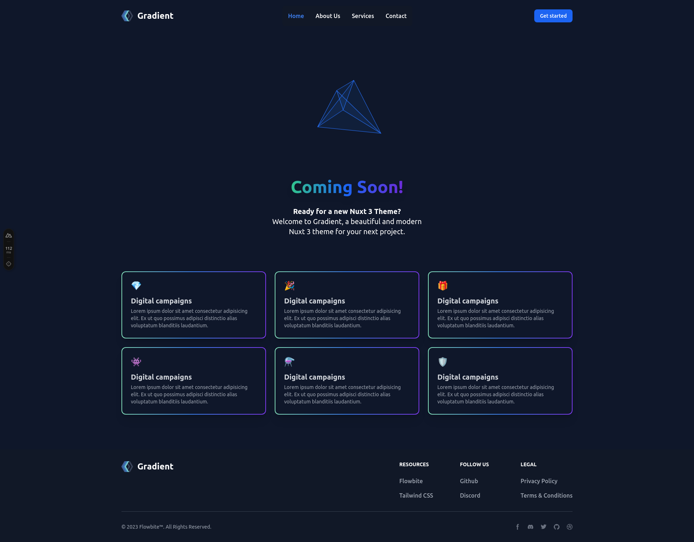
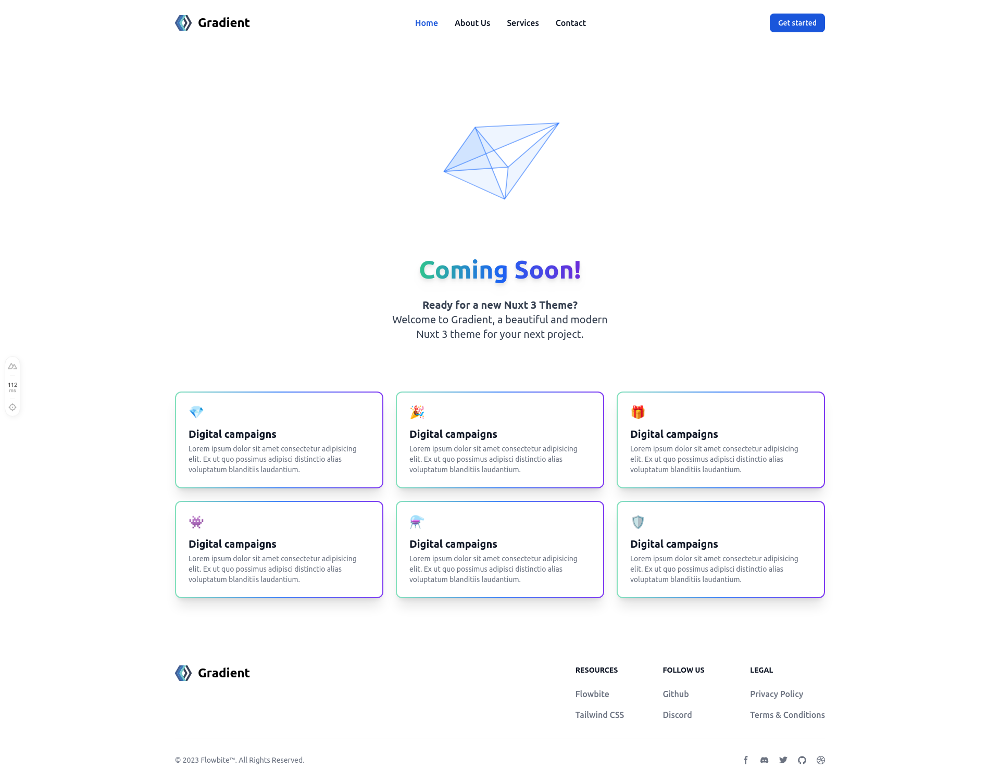

# Nuxt 3 Gradient Template

## UNDER ACTIVE DEVELOPMENT ⚠️

Look at the [Nuxt 3 documentation](https://nuxt.com/docs/getting-started/introduction) to learn more.

## Setup

The project is built with [pnpm](https://pnpm.io/).

This template is a full Nuxt 3 setup.

Make sure to install the dependencies after cloning the template/github repo:

```bash
git clone https://github.com/dazeb/Nuxt3-Gradient-Template.git
```

```bash
cd Nuxt3-Gradient-Template
```

### Enable Corepack

This enables Yarn, NPM and PNPM to use the same dependencies.

```bash
corepack enable
```

### Install dependencies (pnpm preferred)

```bash
# npm
npm install

# pnpm
pnpm i

# yarn
yarn install
```

## Development Server

Start the development server on `http://localhost:3000`:

```bash
# npm
npm run dev

# pnpm
pnpm dev

# yarn
yarn dev
```

## Production

Build the application for production:

```bash
# npm
npm run build

# pnpm
pnpm build

# yarn
yarn build
```

### Screenshots

Dark and light theme




